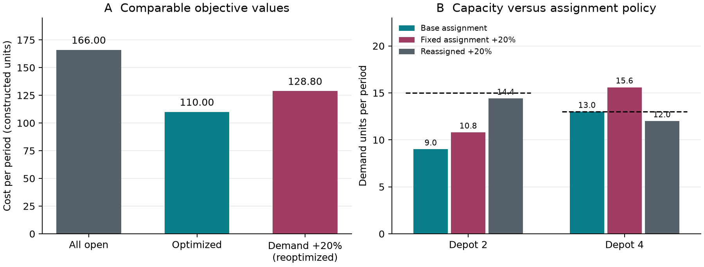

# 容量约束下配送站点的选择与需求扰动分析

## 摘要

配送站点数量减少可以节省固定运营费，但也会改变客户分配并压缩容量余量。本文针对四个候选站点、五个需求点的构造算例，建立包含启用费用、单位配送费用和站点容量的单源分配模型。以混合整数规划求解，以不调用优化器的穷举程序独立复算，并将全部站点营业作为运营基线。结果表明，基准需求下仅开启站点2和4即可获得最小周期成本110.00，而全部营业的最优分配成本为166.00。需求统一增加20%后，重新分配可将最优成本控制在128.80，仍只需相同两个站点；但若保留原客户分配，站点4将超载。这一区别说明，布局稳定并不等同于原执行方案稳健。本文给出目标值、容量核算和独立验证过程，并明确结论仅适用于已知需求、单站服务和所列成本口径。算例用于检验可复现建模论证，不代表真实企业的经营改善幅度。

关键词：容量选址；混合整数规划；独立复算；需求扰动；固定策略

## 1 问题与数据

研究对象是在候选站点中选择营业集合，并为每个需求点指定唯一服务站。决策需要同时回答三个问题：基准需求下应开启哪些站点；与全部营业相比是否降低总成本；当需求扩大时，原方案在哪些条件下仍可执行。只比较配送距离或只减少站点数量均不充分，因为两类费用及容量约束会共同影响分配。本文将模型与求解分开验证，避免把“程序返回一个数值”直接解释为正确的运营建议。

所有输入均为作者构造的确定性数据，完整列于表1和表2。固定费用的单位为成本单位/周期，需求和容量的单位为货量单位/周期，单位配送费用为成本单位/货量单位。各站容量均指同一周期的可用服务量，不包含车辆在途时间、班次安排或排队容量。数值并非货币报价，也未经真实企业观测校准。为便于独立复现，正文站点编号从1开始，代码数组从0开始，需求点顺序在所有文件中保持一致。

表1 候选站点参数与单位配送费用

| 站点 | 固定费用 | 容量 | 客户1 | 客户2 | 客户3 | 客户4 | 客户5 |
| --- | --- | --- | --- | --- | --- | --- | --- |
| 1 | 32 | 12 | 2 | 5 | 4 | 7 | 6 |
| 2 | 28 | 15 | 4 | 2 | 6 | 3 | 5 |
| 3 | 38 | 10 | 6 | 4 | 2 | 5 | 3 |
| 4 | 24 | 13 | 5 | 6 | 4 | 2 | 2 |

表2 基准周期的客户需求

| 客户 | 1 | 2 | 3 | 4 | 5 |
| --- | --- | --- | --- | --- | --- |
| 需求 | 4 | 5 | 3 | 6 | 4 |

## 2 假设与符号

首先，假设同一情景内需求确定且必须全部满足，不允许延迟交付或缺货。其次，每个客户只能由一个站点服务，不拆分需求；客户之间的配送费用相互独立且与货量成正比。再次，固定费用只要站点营业就发生，关停站点不能服务客户。最后，所设需求扰动在重新优化时已知，因此情景最优解属于有信息后的调整，不是提前制定的随机或鲁棒策略。

记客户集合为 $I$，站点集合为 $J$，客户需求为 $d_i$，站点容量为 $u_j$，固定费用为 $f_j$，单位配送费用为 $c_{ji}$。二元变量 $y_j$ 表示站点是否营业；二元变量 $x_{ji}$ 表示客户 $i$ 是否由站点 $j$ 服务。目标值 $z$ 为同一周期的固定费用与配送费用之和。上述符号把输入、决策和输出区分开，避免将容量上限误当作必须达到的负载。

## 3 模型构建

目标函数如式（1）。第二项必须乘以客户需求，否则计算的是客户数量加权费用，不能与本算例的单位货量费用相匹配。

$$
\min z=\sum_{j\in J}f_jy_j+\sum_{j\in J}\sum_{i\in I}c_{ji}d_ix_{ji}
$$

式（1）周期总成本。

每个客户恰好归属于一个站点，对应式（2）。该约束既不允许缺失服务，也不允许将一个客户的完整需求重复计算。

$$
\sum_{j\in J}x_{ji}=1,\quad i\in I
$$

式（2）单源完整服务约束。

容量与营业状态通过式（3）耦合。由于全部需求严格为正，关闭站点的右端为零，从而禁止其承接任何客户；开放后总负载不得超过可用容量。变量定义见式（4）。

$$
\sum_{i\in I}d_ix_{ji}\leq u_jy_j,\quad j\in J
$$

式（3）容量与启用约束。

$$
x_{ji}\in\{0,1\},\quad y_j\in\{0,1\}
$$

式（4）二元决策变量的取值域。

“全部营业”基线不是随意分配，而是在相同目标与约束下固定所有 $y_j=1$，仍求最优客户分配。因此模型收益不会被故意较差的基线夸大。需求扩大情景仅将 $d_i$ 替换为 $1.2d_i$，保持固定费用、单位费用和容量不变。若实际业务存在新增车辆费用或分段价格，应修改费用函数，不能直接套用本文的情景结论。

## 4 求解与独立验证

主实现将模型提交给 SciPy 的 HiGHS 混合整数规划求解器，同时保存可行目标、对偶下界、最优间隙和约束违反量。验证实现独立枚举每个客户可选择的四个站点，共检查1024种分配。对每种分配，先按客户逐项累计站点负载并排除超容量方案，再分别核算启用费用与配送费用；该实现不导入主求解器，也不共享其约束矩阵构造代码。

在自由选址情形，穷举程序只开启实际承担需求的站点。这不遗漏最优方案：所有固定费用为正，任何未服务客户却营业的站点均可关闭而不影响可行性，并严格减少费用。全部营业基线则明确收取全部固定费用，不能沿用这个缩减。由此，穷举覆盖了本算例中可能最优的分配，而不只是验证主程序给出的单个答案。

基准、全部营业和需求扩大三类情景分别执行两种实现，共形成六次真实求解。目标值采用预先声明的绝对容差 $10^{-7}$ 和相对容差 $10^{-9}$ 比较，具体记录保存在复算报告 replication_report.json；同时检查分配、负载和费用的实际含义，不把目标相近作为约束正确的替代证据。本问题为确定性小规模整数优化，不人为制造随机种子或置信区间。最优性结论来自有限空间穷举以及求解器界证书，而非多次运行得到相同答案。

## 5 结果与敏感性分析

基准最优成本为110.00。开启站点2和4，客户1、2由站点2服务，客户3、4、5由站点4服务。相应固定费用为52，配送费用为58，两项相加得到目标值；两个独立实现的目标一致。这里报告的是一个最优分配，不另作唯一性声明。<!-- claim:Ccost -->

全部营业且重新优化分配时，成本为166.00。其固定费用122、配送费用44。与之相比，自由选址减少固定费用70，却增加配送费用14，净节约56。说明收益来自在固定投入与运输开销之间重新权衡，而不是所有客户的配送都变得更便宜。若只展示运输费用，自由选址反而较差；若只展示总成本而隐藏分项，则不易解释改进机制。<!-- claim:Cbaseline -->

需求统一增加20%并允许重新分配后，最优成本为128.80。仍开启站点2和4，但客户3由站点4转交站点2，得到负载14.4和12.0，均满足各自容量。固定费用保持52，配送费用增至76.8。目标增长既包含货量增加，也包含分配调整；不能简单用基准总成本乘以需求系数估算。<!-- claim:Cstress -->

表3 三种情景的独立目标值与费用分解

| 情景 | 主求解器 | 独立穷举 | 固定费用 | 配送费用 |
| --- | --- | --- | --- | --- |
| 基准自由选址 | 110.00 | 110.00 | 52.00 | 58.00 |
| 全部营业基线 | 166.00 | 166.00 | 122.00 | 44.00 |
| 需求增加20%后重优化 | 128.80 | 128.80 | 52.00 | 76.80 |

图1把费用比较与容量约束放在同一视图中。左图比较口径一致的目标值；右图同时给出基准负载、原分配在扰动下的负载、允许调整后的负载，虚线分别为两个站点容量。图中数据由保存的计算输出直接生成，而非按预期结论手绘。

关键风险在于基准站点4的负载已经达到容量13，站点2虽有余量，却不能在不改变客户归属时自动承接多出的货物。若所有需求同比增加且原分配保持不变，站点4负载立即超过上限。在20%扰动下，其负载达到15.6，超出2.6；此时原方案不可行，不能报告一个有限成本就认为方案可以执行。客户3的转移是本情景恢复可行性的具体措施。

还需要区分“站点集合不变”与“客户分配不变”。基准和扰动后的最优站点集合相同，只能说明在这两个已算情景中无需新增营业站点，不能推出整个需求区间内布局都不变。本文没有搜索所有中间扰动点，也没有求出最优布局切换的阈值。若要形成执行承诺，应进一步检验客户是否允许换站、转移的实施时间与费用，以及扰动发生后是否来得及调整。

这里的压力测试给出条件性判断：在需求已知且可以重分配的条件下，两个站点能够服务扩大后的需求；在固定原分配的条件下，容量约束失效。它不是“有较高概率保持可靠”的统计结论，因为输入未给出需求分布或历史样本。消融通常针对可分离学习模块，本算例没有这类模块；全部营业约束的干预已作为基线单独比较，没有为凑实验数量移除必要的物理容量约束。

## 6 讨论与结论

本算例的贡献不是提出新优化算法，而是将可解释的运营基线、独立求解证据和策略可执行性放在同一分析链条中。四种候选思路中，全部营业保留为对照，整数规划承担正式求解，穷举承担小实例复核；贪心分配因缺少全局最优保证且容易受容量顺序影响，未被选作关键结论的证据。该选择针对本题数据规模，不意味着穷举适合更大网络。客户增加时分配空间按指数增长，应转向界证书、独立可行性验证及适当的分解方法。

使用建议应附带边界。首先，模型把单周期总量视为可交换货量，未描述车辆路径、时间窗、交通拥堵和服务时长，因此不能直接生成实际配送排班。其次，构造费用不存在观测误差，只适合检验计算机制；真实部署前应统一成本口径并验证需求与容量。再次，压力情景允许观察到需求后进行调整，未考虑合同锁定和调整成本。若客户不能跨站迁移，应在初始决策中保留安全容量，而非依赖事后重分配。

在所列假设下，选择站点2和4取得基准最优解，并通过独立穷举复算；全部营业虽然降低配送费用，却因额外固定开销使总费用更高。需求扩大实验进一步揭示了一个比目标值更重要的限制：既有站点布局可以延用，并不代表既有客户分配能够延用。合理的建模结论应同时说明成本、约束、允许采取的调整和未验证的范围，而不是仅输出一个看似精确的最小值。

本文未使用外部行业数据或文献数值，不为构造数据添加虚构引用。可复现材料包括完整输入、两种求解代码、六组原始指标、绘图程序及生成文件。后续真实赛题验证应采用独立来源数据和更复杂的约束，检验模型选择与论证能力，而不能由本小规模算例推断竞赛成绩。
